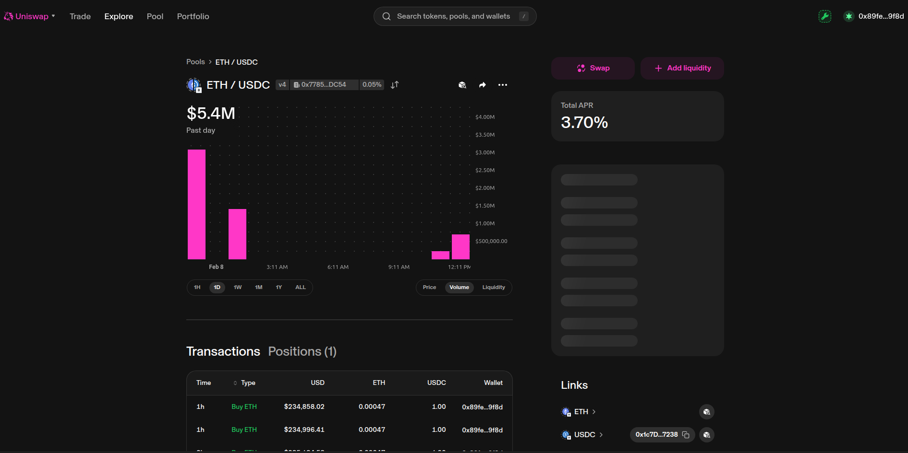

# PrivyFlow 🔒 - Privacy-Preserving DEX on Uniswap v4

PrivyFlow is a dark pool DEX built on Uniswap v4 hooks that enables privacy-preserving swaps using a commit-reveal scheme. Users commit to trades without revealing amounts, then execute after a 10-block delay to prevent MEV and front-running.

(images/1.png)

**Live Demo**: [privyflow.vercel.app](https://privyflow.vercel.app) (connect to Sepolia)

## 🎯 Problem Statement

**MEV attacks and front-running** cost DeFi users millions annually. When you submit a swap on a public blockchain:
- Bots see your transaction in the mempool
- They front-run you to extract value
- You get worse prices than expected

**Solution**: Hide the trade details until execution time using cryptographic commitments with a 10-block delay — reducing unnecessary information exposure and making trading more resilient to extractive dynamics.

## 🔧 How It Works

### Commit-Reveal Flow (3 Phases)

**Phase 1: Commit**
- User enters swap amount (e.g., 1 USDC)
- Frontend generates random salt (e.g., `52555232`)
- Computes commitment: `keccak256(amount, minOut, salt)`
- Submits commitment hash to CommitStore
- Waits 10 blocks (~2 minutes on Sepolia)

**Phase 2: Reveal**
- After 10-block delay passes
- User approves token spend (if ERC20)
- Reveals salt + commitment to DarkPoolHook
- Hook verifies commitment is valid and not spent
- Marks commitment as revealed

**Phase 3: Execute**
- Uniswap v4 PoolManager executes swap
- Tokens transferred via hook validation
- Commitment marked as spent forever

### System Architecture
```
User → Frontend → Smart Contracts → Uniswap v4 Pool
        ↓ ↓
    [React/Wagmi] [CommitStore] ← Stores commitments
    [Salt Gen] [DarkPoolHook] ← Validates + executes
    [Countdown] [SwapRouter] ← Handles settlement
```

## 🚀 Features

### Privacy-First Trading
- **Hidden Amounts**: Trade sizes encrypted using cryptographic commitments
- **MEV Protection**: 10-block delay prevents sandwich attacks
- **No Front-Running**: Commitments can't be frontrun or decoded

### Dual Interface
1. **Swap**: Privacy-preserving swaps via commit-reveal
2. **Pool**: Add liquidity to ETH/USDC dark pool (fee tier selection + price range)

### Liquidity Management
- Select fee tier (0.01%, 0.05%, 0.3%, 1%)
- Set custom price ranges or full range
- Visual price range indicators
- Max balance buttons for easy deposit

## 📋 Smart Contracts

### CommitStore.sol
Stores commitments and enforces the 10-block privacy delay.
```solidity
function commit(bytes32 commitment, bytes32 nullifier) external;
function canReveal(bytes32 commitment, uint256 amount, uint256 minOut, uint256 salt)
    external view returns (bool);
```
**Address**: `0xdC81d28a1721fcdE86d79Ce26ba3b0bEf24C116C`

### DarkPoolHook.sol
Uniswap v4 hook with `BEFORE_SWAP` flag (0x04) that verifies commitments.
```solidity
function beforeSwap(address, PoolKey calldata key, SwapParams calldata params, bytes calldata hookData)
    external returns (bytes4, BeforeSwapDelta, uint24);
```
**Address**: `0x77853497C9dEC9460fb305cbcD80C7DAF4EcDC54`

### SwapRouter.sol
Handles the unlock/settlement pattern for Uniswap v4.
**Address**: `0xB276FA545ed8848EC49b2a925c970313253B90Ba`

### PoolManager (Uniswap v4)
**Address**: `0xE03A1074c86CFeDd5C142C4F04F1a1536e203543`

## 🧪 Live Pool & Onchain Evidence

### Live Pool on Uniswap Explorer (Sepolia)
View the active ETH/USDC 0.05% pool with PrivyFlow's DarkPoolHook attached and a full history of successful swaps:

🔗 [Uniswap Pool Explorer](https://app.uniswap.org/explore/pools/ethereum_sepolia/0x40e90c1cd6b4fdf40e41ea9f3b540d10008fae40f3a33c1f129efb2654471130)



### Example End-to-End Flow (1 USDC → ETH)

**Step 1: Commit**

- **Tx**: [`0x2ce4de59918e7c8de318e0bc5cc61d61f575fd412bf137ded923e5f926044cfb`](https://sepolia.etherscan.io/tx/0x2ce4de59918e7c8de318e0bc5cc61d61f575fd412bf137ded923e5f926044cfb)

**Step 2: Approve**

- **Tx**: [`0x142fbbedb64dd710f264bc521edb7c70302e16a5a002a0f95625add2899c119c`](https://sepolia.etherscan.io/tx/0x142fbbedb64dd710f264bc521edb7c70302e16a5a002a0f95625add2899c119c)

**Step 3: Reveal & Swap Success**

- **Tx**: [`0xd8c5eec284672a129f50cf92dfc0bd6bb8a35f93d9159b47ac3f9ac3656bcb0c`](https://sepolia.etherscan.io/tx/0xd8c5eec284672a129f50cf92dfc0bd6bb8a35f93d9159b47ac3f9ac3656bcb0c)
- **Block**: 10214314
- **Input**: 1 USDC
- **Output**: 0.000470821187905029 ETH
- **Rate**: ~2,124 USDC/ETH

### Contract Verification
- ✅ CommitStore deployed and verified
- ✅ DarkPoolHook deployed with BEFORE_SWAP flag (0x04)
- ✅ SwapRouter deployed with fixed settlement logic
- ✅ Pool initialized: ETH/USDC 0.05% fee, tick spacing 10
- ✅ Successfully executed multiple end-to-end private swaps

## 🚀 Quick Start

### Prerequisites
- Node.js 18+
- MetaMask or Web3 wallet
- Sepolia ETH ([faucet](https://sepoliafaucet.com))

### Installation
```bash
git clone https://github.com/0xfdbu/hackmoney2026.git
cd hackmoney2026/frontend
npm install
npm run dev
```

### Connect to Sepolia
1. Switch MetaMask to Sepolia (Chain ID: 11155111)
2. Get test ETH
3. Visit the live demo and connect wallet

## 📱 Usage Guide

### Swapping (Privacy Mode)
1. **Commit Phase** — Enter amount, click "Commit Swap", **SAVE YOUR SALT**
2. **Wait 10 Blocks** — Visual countdown (~2 min)
3. **Reveal Phase** — Click "Reveal Swap" when ready → private execution

### Adding Liquidity
- Choose fee tier
- Set price range (or full range)
- Deposit ETH + USDC

## 🔑 Key Features

| Feature              | Description                                              |
|----------------------|----------------------------------------------------------|
| Hidden Amounts       | Trade size encrypted using keccak256 commitments         |
| MEV Protection       | 10-block delay prevents sandwich attacks                 |
| Self-Custody         | No custody of funds, fully decentralized                 |
| Time-Locked          | Enforced delay between commit and reveal                 |
| Range Orders         | Full range or concentrated liquidity positions           |

## 📊 Tech Stack
- **Smart Contracts**: Solidity 0.8.26, Foundry, Uniswap v4
- **Frontend**: React 18, TypeScript, Vite, Tailwind CSS
- **Web3**: Reown AppKit, Wagmi, Viem
- **Network**: Ethereum Sepolia

## 🔒 Security Considerations
- Salt generated client-side — lost salt = lost funds
- 10-block delay adds ~2 min latency for privacy
- Use high slippage (100%) on skewed test pools
- Hook address ends in `...C54` for callback eligibility

## 📝 License
MIT License — see [LICENSE](./LICENSE)

## 🚀 Acknowledgments
- Uniswap Labs for v4 hooks
- Foundry team
- Ethereum Foundation (Sepolia)
- Reown AppKit

---
**Built with ❤️ for HackMoney 2026 – Uniswap v4 Volatile-Pairs Hooks (Privacy) track**