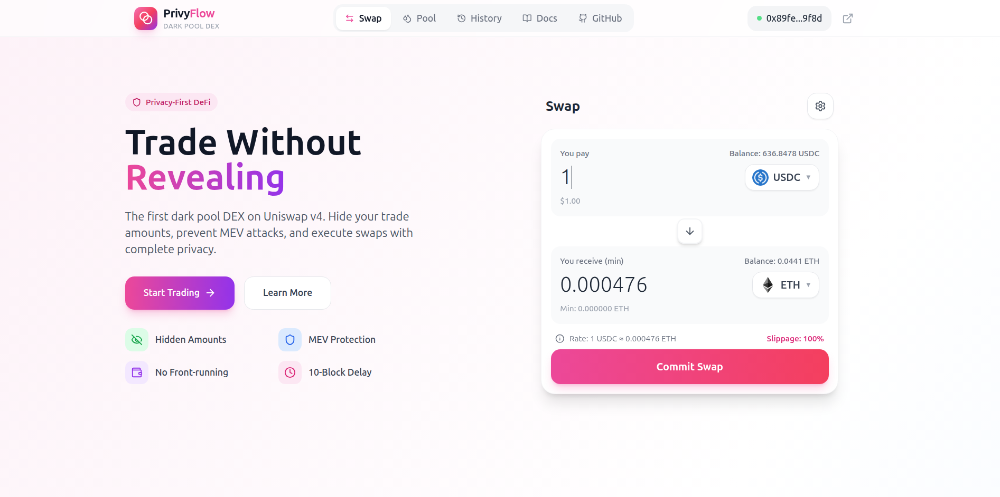
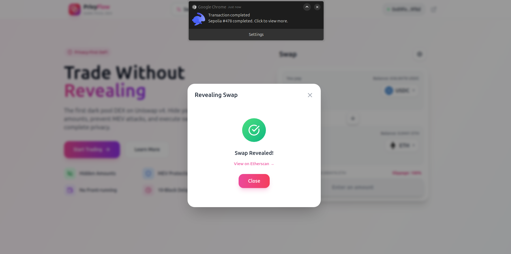

# PrivyFlow 🔒 - Privacy-Preserving DEX on Uniswap v4

PrivyFlow is a dark pool DEX built on Uniswap v4 hooks that enables privacy-preserving swaps using a commit-reveal scheme. Users commit to trades without revealing amounts, then execute after a 10-block delay to prevent MEV and front-running.

## 🎯 Problem Statement

**MEV attacks and front-running** cost DeFi users millions annually. When you submit a swap on a public blockchain:
- Bots see your transaction in the mempool
- They front-run you to extract value
- You get worse prices than expected

**Solution**: Hide the trade details until execution time using cryptographic commitments with a 10-block delay.

## 🔧 How It Works

### Commit-Reveal Flow (3 Phases)

**Phase 1: Commit**
- User enters swap amount (e.g., 1 USDC)
- Frontend generates random salt (e.g., `52555232`)
- Computes commitment: `keccak256(amount, minOut, salt)`
- Submits commitment hash to CommitStore
- Waits 10 blocks (~2 minutes)

**Phase 2: Reveal**
- After 10-block delay passes
- User approves token spend (if ERC20)
- Reveals salt + commitment to DarkPoolHook
- Hook verifies commitment is valid and not spent
- Marks commitment as revealed

**Phase 3: Execute**
- Uniswap v4 PoolManager executes swap
- Tokens transferred via hook validation
- Commitment marked as spent forever

### System Architecture

```
User → Frontend → Smart Contracts → Uniswap v4 Pool
        ↓              ↓
    [React/Wagmi]  [CommitStore] ← Stores commitments
    [Salt Gen]     [DarkPoolHook] ← Validates + executes
    [Countdown]    [SwapRouter] ← Handles settlement
```

## 🚀 Features

### Privacy-First Trading
- **Hidden Amounts**: Trade sizes encrypted using cryptographic commitments
- **MEV Protection**: 10-block delay prevents sandwich attacks
- **No Front-Running**: Commitments can't be frontrun or decoded

### Dual Interface
1. **Swap**: Privacy-preserving swaps via commit-reveal
2. **Pool**: Add liquidity to ETH/USDC dark pool (fee tier selection + price range)

### Liquidity Management
- Select fee tier (0.01%, 0.05%, 0.3%, 1%)
- Set custom price ranges or full range
- Visual price range indicators
- Max balance buttons for easy deposit

## 📋 Smart Contracts

### CommitStore.sol
Stores commitments and enforces the 10-block privacy delay.

```solidity
function commit(bytes32 commitment, bytes32 nullifier) external;
function canReveal(bytes32 commitment, uint256 amount, uint256 minOut, uint256 salt) 
    external view returns (bool);
```

**Address**: `0xdC81d28a1721fcdE86d79Ce26ba3b0bEf24C116C`

### DarkPoolHook.sol
Uniswap v4 hook with `BEFORE_SWAP` flag (0x04) that verifies commitments.

```solidity
function beforeSwap(address, PoolKey calldata key, SwapParams calldata params, bytes calldata hookData) 
    external returns (bytes4, BeforeSwapDelta, uint24);
```

**Address**: `0x77853497C9dEC9460fb305cbcD80C7DAF4EcDC54`

### SwapRouter.sol
Handles the unlock/settlement pattern for Uniswap v4.

**Address**: `0xB276FA545ed8848EC49b2a925c970313253B90Ba`

### PoolManager (Uniswap v4)
**Address**: `0xE03A1074c86CFeDd5C142C4F04F1a1536e203543`

## 🚀 Quick Start

### Prerequisites
- Node.js 18+
- MetaMask or Web3 wallet
- Sepolia ETH (from [faucet](https://sepoliafaucet.com/ ))

### Installation

```bash
# Clone repo
git clone https://github.com/0xfdbu/hackmoney2026.git 
cd privyflow

# Install dependencies
npm install

# Run dev server
npm run dev
```

### Connect to Sepolia
1. Switch MetaMask to Sepolia Testnet (Chain ID: 11155111)
2. Get Sepolia ETH from faucet
3. Connect wallet to PrivyFlow

## 📱 Usage Guide

### Swapping (Privacy Mode)

**1. Commit Phase**
- Enter swap amount (e.g., 1 USDC → ETH)
- Select slippage (recommend 100% for skewed pools)
- Click **"Commit Swap"**
- **⚠️ CRITICAL: SAVE YOUR SALT!** Required for reveal

**2. Wait 10 Blocks**
- Visual countdown shows remaining blocks
- ~2 minutes on Sepolia
- Commitment stored in localStorage

**3. Reveal Phase**
- Click **"Reveal Swap"** when countdown finishes
- Hook verifies commitment on-chain
- Swap executes through Uniswap v4
- Receive ETH!

### Adding Liquidity

**1. Select Fee Tier**
- 0.01% - Best for stable pairs
- 0.05% - Best for blue chips
- 0.3% - Best for most pairs
- 1% - Best for exotic pairs

**2. Check Pool Status**
- System checks if pool exists for selected fee
- If not initialized, you'll be prompted to initialize

**3. Set Price Range**
- View current pool price
- Set Min/Max price range (or select Full Range)
- Visual tick range indicators

**4. Deposit**
- Enter ETH and USDC amounts
- Click "Add Liquidity"
- Confirm transactions (approve + mint)

## 🔑 Key Features

| Feature | Description |
|---------|-------------|
| **Hidden Amounts** | Trade size encrypted using keccak256 commitments |
| **MEV Protection** | 10-block delay prevents frontrunning |
| **Self-Custody** | No custody of funds, fully decentralized |
| **Time-Locked** | Enforced delay between commit and reveal |
| **Range Orders** | Full range or concentrated liquidity positions |

## 🧪 Live Transactions

### Example Flow (1 USDC → ETH)

**Step 1: Commit**

- **Tx**: `0x2ce4de59918e7c8de318e0bc5cc61d61f575fd412bf137ded923e5f926044cfb`
- Submit commitment hash to store

**Step 2: Approve**

- **Tx**: `0x142fbbedb64dd710f264bc521edb7c70302e16a5a002a0f95625add2899c119c`
- Approve token spend for reveal

**Step 3: Swap Success**

- **Tx**: `0xd8c5eec284672a129f50cf92dfc0bd6bb8a35f93d9159b47ac3f9ac3656bcb0c`
- **Block**: 10214314
- **From**: `0x89feEbA43b294425C0d7B482770eefbcc1359f8d`
- **To**: `0xB276FA545ed8848EC49b2a925c970313253B90Ba` (SwapRouter)
- **Input**: 1 USDC
- **Output**: 0.000470821187905029 ETH
- **Rate**: ~2,124 USDC/ETH

### Contract Verification
- ✅ CommitStore deployed and verified
- ✅ DarkPoolHook deployed with BEFORE_SWAP flag (0x04)
- ✅ SwapRouter deployed with fixed settlement logic
- ✅ Pool initialized: ETH/USDC 0.05% fee, tick spacing 10
- ✅ Successfully executed end-to-end swap

## 📊 Tech Stack

- **Smart Contracts**: Solidity 0.8.26, Foundry, Uniswap v4
- **Frontend**: React 18, TypeScript, Vite, Tailwind CSS
- **Web3 Integration**: Reown AppKit, Wagmi, Viem
- **Network**: Ethereum Sepolia Testnet (Chain ID: 11155111)
- **Pool**: ETH/USDC with dynamic fee tiers

## 🔒 Security Considerations

- **Salt Storage**: Salt generated client-side, never stored on-chain. Lost salt = lost funds
- **Timing**: 10-block delay provides privacy but adds ~2min latency
- **Price Impact**: Use high slippage (100%) for testing with skewed pools
- **Hook Verification**: DarkPoolHook address ends in 0x...C54 to enable callbacks

## 📝 License

MIT License - see LICENSE file

## 🙏 Acknowledgments

- Uniswap Labs for v4 hooks architecture
- Foundry team for testing framework
- Ethereum Foundation for Sepolia testnet
- Reown (prev. WalletConnect) for AppKit

---

**Built with ❤️ for HackMoney 2026**
